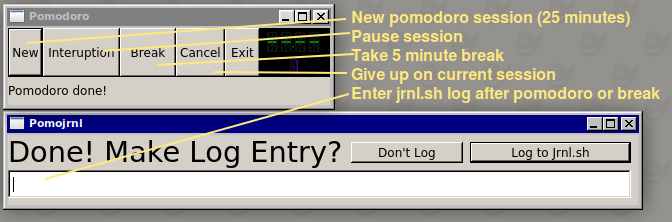

# Pomojrnl

A linux-only GUI for [jrnl.sh](http://jrnl.sh/) users that also do [the whole pomodo thing](https://en.wikipedia.org/wiki/Pomodoro_Technique) written in [Gambas BASIC](https://en.wikipedia.org/wiki/Gambas).

# Is It Any Good?

This project had two goals:

 * Remind myself to write `jrnl` entries after a pomodoro session.
 * Learn "real world" Gambas in 2019

In that regard, the project has met its goals. I am unlikely to support future updates. I _am_ interested in hearing about forks and new ideas, though. Feel free to contact me or raise an issue if you have found this code helpful.

# Pre-requisites

 * Ubuntu
 * Must have `jrnl` in your `PATH` (this app just shells out to `jrnl`)

# Installation

WIP
